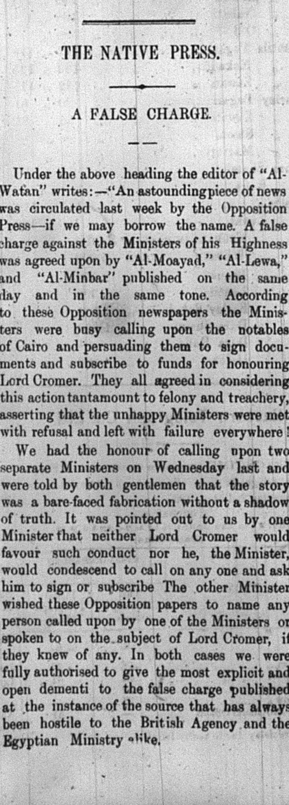

###The Native Press
####A False Charge?
 
One article that I found very interesting was titled _The Native Press; A False Charge_. It was about an article written by the editor of _Al-Watan_, criticizing a news story published in several other native newspapers (which the editor called the “Opposition Press”) criticizing the “Ministers of his Highness”, saying that they had spent all day calling important people in Cairo and trying to persuade them to honor and give money to Lord Cromer, and that they were “met with refusal and left with failure everywhere!” This suggests that there was strife between the different native newspapers around the presence of Britain in Egypt. In the _Al-Watan_ article, the editor is very positive towards the British, referring to them as gentlemen, and saying he had the “honour of calling upon” them. He is very critical of the Opposition Papers, saying that the news story was a “bare-faced fabrication without a shadow of truth.” This tells me that some of the Native newspapers did not support the British presence, and published articles that portrayed them negatively, while at least one, _Al-Watan_, was very much in support of the British presence and even came to their defense against the Opposition Papers. In the book [_Nurturing the Nation: The Family Politics of Modernizing, Colonizing, and Liberating Egypt, 1805-1923_](www.jstor.org/stable/10.1525/j.ctt1pp5cp) by Lisa Pollard she writes, of the native papers in Egypt in the early 1900s, “While editors differed in political orientation- some encouraged continued Ottoman Sovereignty while others demanded egypt for the Egyptians- they appear united in their demands for increased political participation for Arabophone Egyptians in politics.” This suggests that _Al-Watan_ was notable in its support of the British, which may be why the _Egyptian Gazette_ published this article. In another article from May 23rd, 1907, the native press in India is described as “preaching a crusade of rebellion with the unrestrained oratory in which both native writers and readers exult.” 
In [_Lord Cromer in the 'Egyptian Gazette' _](https://dig-eg-gaz.github.io/post/18-analysis-pregasen/ ), Melissa Pregasen writes that Lord Cromer “advocated for more British rule over the lands and dismissed the Egyptian demands for independence from Britain.” It seems that the native press largely opposed Lord Cromer and his Government, which is why this article was noteworthy.
 In a letter to the editor from January 28th, 1907, a reader wrote that he thought it was unwise to threaten the natives with sending more troops in, because many of them thought there were only two dozen or so troops in Alexandria, and they could use this to their advantage. I thought this was interesting because clearly the editor of the Egyptian Gazette was reading the native papers, as evidenced by _The Native Press; A False Charge_, but as they published this letter openly describing a way the natives could be deceived, it would seem they did not think that the natives would read their newspaper.
They clearly considered it newsworthy that this event occurred in the native press, most likely because an overwhelming majority of the time Britain being slandered, not defended, by native papers. 